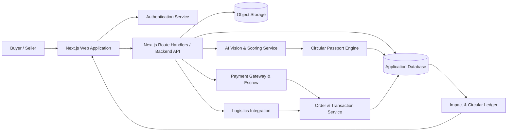
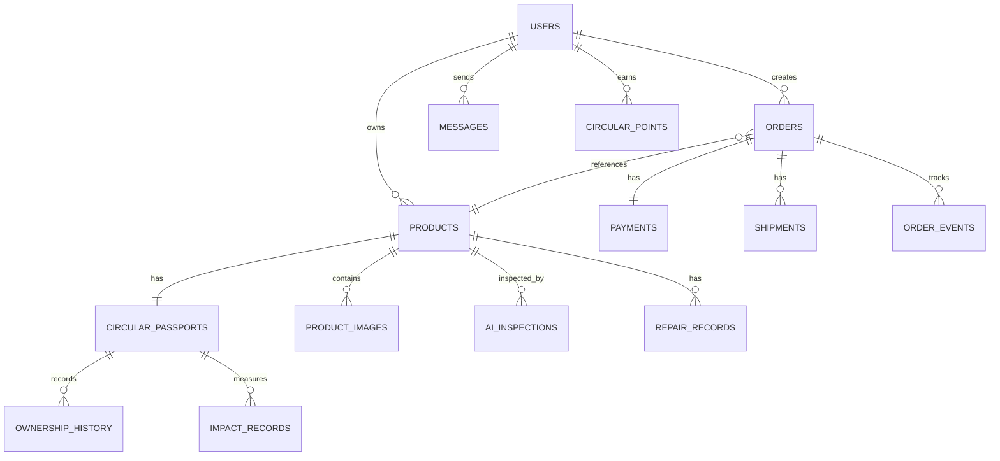

<div align="center">

# PakaiLagi
### Marketplace Pre-Loved Berbasis AI untuk Ekonomi Sirkular yang Transparan, Aman, dan Berkelanjutan

[](https://[URL_DEMO])
[](https://[URL_REPO])
[](LICENSE)

**Submission for Trunojoyo Creative Competition 2026 - Vibe Code**

**By [NAMA_TIM]**

</div>

---

## 📋 Daftar Isi

- [Tim Developer](#-tim-developer)
- [Tentang Proyek](#-tentang-proyek)
- [Fitur Unggulan](#-fitur-unggulan)
- [Demo & Screenshot](#-demo--screenshot)
- [Teknologi](#️-teknologi)
- [Arsitektur Sistem](#️-arsitektur-sistem)
- [Instalasi & Setup](#️-instalasi--setup)
- [Penggunaan](#-penggunaan)
- [API Documentation](#-api-documentation)
- [Testing](#-testing)
- [Lisensi](#-lisensi)

---

## 👥 Tim Developer

> Lengkapi nama tim, anggota, peran, dan akun GitHub sebelum submission.

| Nama | Peran | GitHub |
|------|-------|--------|
| **SAYYID MUHAMMAD MUSLIM AS'AD SUNARKO** | Full Stack Developer | [GitHub](https://github.com/[USERNAME_SAYYID]) |
| **[NAMA_LENGKAP_2]** | Project Lead / Product Manager | [GitHub](https://github.com/[USERNAME_2]) |
| **[NAMA_LENGKAP_3]** | Frontend Developer | [GitHub](https://github.com/[USERNAME_3]) |
| **[NAMA_LENGKAP_4]** | Backend / AI Engineer | [GitHub](https://github.com/[USERNAME_4]) |
| **[NAMA_LENGKAP_5]** | UI/UX Designer | [GitHub](https://github.com/[USERNAME_5]) |

---

## 🎯 Tentang Proyek

### Latar Belakang

Pertumbuhan konsumsi perangkat elektronik dan barang rumah tangga mendorong peningkatan volume barang tidak terpakai. Di sisi lain, pasar barang pre-loved masih menghadapi beberapa persoalan utama, seperti deskripsi kondisi yang subjektif, informasi riwayat barang yang terputus, risiko penipuan, ketidakpastian pembayaran, serta minimnya informasi dampak lingkungan dari transaksi.

PakaiLagi hadir sebagai marketplace ekonomi sirkular yang membantu barang layak pakai berpindah kepada pemilik berikutnya melalui proses yang lebih transparan dan terukur. Setiap barang dapat dilengkapi inspeksi visual berbasis AI, skor kondisi, riwayat sirkular, jalur pemanfaatan berikutnya, serta Paspor Digital Sirkular.

> **Placeholder data pendukung:** Tambahkan statistik resmi mengenai jumlah e-waste, tingkat pemanfaatan kembali barang, pertumbuhan pasar pre-loved, atau masalah kepercayaan dalam transaksi barang bekas dari sumber yang relevan dengan ketentuan Trunojoyo Creative Competition 2026.

### Solusi yang Ditawarkan

PakaiLagi menggabungkan marketplace pre-loved, AI-assisted inspection, Paspor Digital Sirkular, Smart Escrow, serta pelacakan dampak lingkungan dalam satu pengalaman pengguna.

Pendekatan utama PakaiLagi meliputi:

1. **AI-assisted inspection** untuk membantu mengidentifikasi kategori, model, kondisi kosmetik, dan indikasi kerusakan barang dari foto.
2. **Circular Passport** untuk menyimpan identitas, skor kondisi, riwayat inspeksi, perbaikan, kepemilikan, dan jalur sirkular barang.
3. **Smart Escrow** untuk menjaga keamanan dana selama proses transaksi dan masa verifikasi barang.
4. **Circular route recommendation** untuk mengarahkan barang ke penjualan kembali, tukar tambah, reparasi, donasi, atau pemanfaatan komponen.
5. **Circular impact tracking** untuk menampilkan estimasi e-waste yang dicegah, emisi CO₂e yang dihemat, dan poin sirkular pengguna.
6. **Zero-waste logistics** melalui dukungan kemasan reusable dan opsi pengiriman rendah emisi.

### Tujuan Proyek

- 🎯 **Tujuan Utama**: Membangun marketplace pre-loved yang meningkatkan kepercayaan transaksi sekaligus memperpanjang siklus hidup barang.
- 📊 **Target Pengguna**: Pembeli barang pre-loved, penjual individu, kolektor, pelaku reparasi, mitra logistik, komunitas, dan pengguna yang peduli terhadap ekonomi sirkular.
- 💡 **Value Proposition**: Transparansi kondisi barang berbasis AI dan Paspor Digital Sirkular, perlindungan transaksi melalui Escrow, serta pengukuran dampak lingkungan pada setiap siklus barang.

---

## ✨ Fitur Unggulan

### Fitur Utama

| Fitur | Deskripsi | Keunggulan |
|------|-----------|------------|
| **AI Scan & Condition Audit** | Mengolah foto multi-angle untuk membantu mengenali produk, mendeteksi kondisi visual, memberikan confidence score, dan mengestimasi nilai jual. | Mengurangi subjektivitas deskripsi dan membantu penjual membuat listing yang lebih informatif. |
| **Circular Passport** | Menyimpan identitas barang, skor kondisi, nomor seri, riwayat inspeksi, perbaikan, perpindahan kepemilikan, serta dampak lingkungan. | Menjaga jejak barang tetap transparan pada setiap siklus penggunaan. |
| **Smart Escrow & Buyer Protection** | Menahan dana hingga proses pengiriman dan masa verifikasi pembeli selesai. | Mengurangi risiko transaksi bagi pembeli maupun penjual. |
| **Circular Route Recommendation** | Memberikan opsi jual kembali, swap, repair, donasi, atau pemanfaatan sparepart berdasarkan kondisi barang. | Mencegah barang layak pakai langsung berakhir sebagai limbah. |
| **Seller Hub** | Menyediakan dashboard, inventaris, AI audit, pesanan, logistik, dan pengelolaan rute sirkular. | Memusatkan operasional penjual pada satu workspace yang terstruktur. |
| **Circular Impact Tracking** | Menampilkan poin sirkular, estimasi e-waste yang dicegah, dan pengurangan emisi CO₂e. | Memberikan indikator dampak yang mudah dipahami oleh pengguna. |

### Fitur Tambahan

- **Marketplace & Discover**: Pencarian, filter, kategori, rekomendasi, dan katalog barang pre-loved.
- **Product Detail**: Informasi kondisi, skor AI, harga, profil penjual, serta ringkasan Paspor Sirkular.
- **Chat & Negotiation**: Komunikasi antara pembeli dan penjual sebelum checkout.
- **Checkout & Payment Flow**: Proses pembayaran dan ringkasan pesanan.
- **Order Status Tracking**: Pelacakan status transaksi dari pembayaran hingga selesai.
- **Seller Inventory Management**: Tabel dan grid inventaris dengan filter, batch selection, serta status audit.
- **AI Scan Error Fallback**: Penanganan foto buram, confidence score rendah, unggah ulang, atau pengisian manual.
- **Manual Listing Form**: Alternatif pembuatan listing tanpa AI dengan deklarasi kondisi oleh penjual.
- **Zero-Waste Packaging Guide**: Instruksi kemasan reusable dan pengurangan material sekali pakai.
- **Low-Emission Logistics**: Informasi kurir EV dan titik serah terima Circular Hub.
- **Responsive Interface**: Tampilan yang disesuaikan untuk desktop, tablet, dan mobile.
- **Custom 404 Recovery Page**: Pencarian dan navigasi pemulihan saat route tidak ditemukan.

---

## 📸 Demo & Screenshot

### Live Demo

🔗 **[Kunjungi Website](https://[URL_DEMO])**

> Ganti `[URL_DEMO]` dengan URL deployment final, misalnya domain Vercel atau domain resmi proyek.

### Screenshot Aplikasi

<div align="center">
  
  <p><em>Marketplace Homepage - Katalog barang pre-loved dan rekomendasi sirkular.</em></p>

  
  <p><em>Product Detail - Informasi produk, skor AI, penjual, dan Paspor Sirkular.</em></p>

  
  <p><em>AI Scan - Analisis visual, deteksi kondisi, estimasi harga, dan dampak sirkular.</em></p>

  
  <p><em>Seller Hub - Inventaris, pesanan, AI audit, dan pengelolaan rute sirkular.</em></p>
</div>

### Video Demo

📹 **[Link Video Demo](https://[URL_VIDEO])** _(opsional)_

---

## 🛠️ Teknologi

### Tech Stack

#### Frontend

```text
Framework    : Next.js 16.3.5 dengan App Router
Language     : TypeScript
UI           : React, CSS Modules, dan reusable components
Icons        : Lucide React
State Mgmt   : React Hooks / [STATE_MANAGEMENT_LIBRARY]
Validation   : Client-side validation / [VALIDATION_LIBRARY]
```

#### Backend

```text
Runtime      : [NODE_JS_OR_SELECTED_RUNTIME]
Framework    : [NEXT_JS_ROUTE_HANDLERS_OR_BACKEND_FRAMEWORK]
Database     : [DATABASE_NAME]
ORM / SDK    : [ORM_OR_DATABASE_SDK]
Storage      : [OBJECT_STORAGE_PROVIDER]
Auth         : [AUTHENTICATION_PROVIDER]
AI Provider  : [AI_VISION_PROVIDER_OR_INTERNAL_MODEL]
Payment      : [PAYMENT_GATEWAY]
```

#### DevOps & Tools

```text
Deployment   : [VERCEL_OR_DEPLOYMENT_PROVIDER]
CI/CD        : [GITHUB_ACTIONS_OR_PLATFORM_PIPELINE]
Testing      : [VITEST_OR_JEST] dan [PLAYWRIGHT_OR_CYPRESS]
Monitoring   : [SENTRY_OR_MONITORING_PROVIDER]
Analytics    : [ANALYTICS_PROVIDER]
Versioning   : Git dan GitHub
```

### Alasan Pemilihan Teknologi

| Teknologi | Alasan Pemilihan |
|-----------|------------------|
| **Next.js App Router** | Mendukung routing berbasis file, pemisahan Server dan Client Component, optimasi build, serta pengembangan aplikasi web modern yang terstruktur. |
| **TypeScript** | Mengurangi kesalahan tipe data dan meningkatkan maintainability pada codebase yang berkembang. |
| **CSS Modules** | Menjaga style tetap terisolasi pada tingkat komponen serta mengurangi konflik class global. |
| **Lucide React** | Menyediakan ikon yang konsisten, ringan, dan mudah digunakan sebagai komponen React. |
| **[DATABASE_NAME]** | [Jelaskan alasan pemilihan database setelah teknologi backend ditetapkan.] |
| **[AI_PROVIDER]** | [Jelaskan alasan pemilihan model AI Vision, batasan, biaya, dan strategi fallback.] |

### Dependencies Utama

> Sesuaikan versi berikut dengan isi `package.json` aktual.

```json
{
  "dependencies": {
    "next": "16.3.5",
    "react": "[VERSION_REACT]",
    "react-dom": "[VERSION_REACT_DOM]",
    "lucide-react": "[VERSION_LUCIDE_REACT]"
  },
  "devDependencies": {
    "typescript": "[VERSION_TYPESCRIPT]",
    "eslint": "[VERSION_ESLINT]",
    "[TESTING_PACKAGE]": "[VERSION]"
  }
}
```

---

## 🏗️ Arsitektur Sistem

### System Architecture

Arsitektur berikut merupakan rancangan konseptual. Sesuaikan nama layanan dengan implementasi backend final.



### Domain Modules

```text
Authentication
├── Login
├── Registration
├── Session
└── Role-based access

Marketplace
├── Homepage
├── Discover & Search
├── Product Detail
├── Chat & Negotiation
└── Favorites

Transaction
├── Checkout
├── Payment
├── Smart Escrow
├── Order Status
└── Dispute / Return

Seller Hub
├── Dashboard
├── Inventory
├── AI Scan & Audit
├── Orders & Logistics
└── Swap / Repair Route

Circular System
├── Circular Passport
├── Condition History
├── Ownership History
├── Impact Calculation
└── Circular Points
```

### Database Schema

Skema berikut masih berupa rancangan awal dan harus diselaraskan dengan database final.



### Folder Structure

Struktur berikut menggambarkan pendekatan Next.js App Router yang digunakan pada implementasi antarmuka saat ini.

```text
project-root/
├── public/                         # Static assets
├── src/
│   ├── app/                        # Next.js App Router
│   │   ├── login/                  # Login page
│   │   ├── register/               # Registration page
│   │   ├── dashboard/              # Buyer marketplace dashboard
│   │   ├── discover/               # Product discovery
│   │   ├── product/                # Product detail routes
│   │   ├── checkout/               # Checkout flow
│   │   ├── status/                 # Order status
│   │   ├── profile/                # User profile
│   │   ├── seller/                 # Seller workspace
│   │   │   ├── dashboard/
│   │   │   ├── inventory/
│   │   │   ├── scan/
│   │   │   ├── review/
│   │   │   ├── orders/
│   │   │   └── routes/
│   │   ├── api/                    # Route Handlers, jika digunakan
│   │   └── not-found.tsx           # Custom 404 page
│   ├── components/
│   │   ├── auth/                   # Authentication UI
│   │   ├── marketplace/            # Marketplace components
│   │   ├── seller/                 # Seller-specific components
│   │   └── errors/                 # Error and fallback components
│   ├── data/                       # Temporary data / fixtures
│   ├── features/                   # [OPTIONAL_FEATURE_MODULES]
│   ├── hooks/                      # Custom React hooks
│   ├── lib/                        # Shared libraries and configuration
│   ├── services/                   # API and external service adapters
│   ├── types/                      # Shared TypeScript types
│   └── utils/                      # Utility functions
├── tests/                          # Unit, integration, and E2E tests
├── docs/                           # Technical documentation
├── .env.example                    # Environment variable template
├── package.json
├── tsconfig.json
└── README.md
```

---

## ⚙️ Instalasi & Setup

### Prerequisites

Pastikan perangkat pengembangan telah memiliki:

- **Node.js** versi yang didukung oleh Next.js 16, gunakan versi LTS terbaru yang kompatibel.
- **npm**, **yarn**, atau **pnpm**.
- **Git**.
- **[DATABASE_NAME]**, jika backend menggunakan database lokal.
- Akun dan credential untuk layanan eksternal yang digunakan.

### Langkah Instalasi

#### 1️⃣ Clone Repository

```bash
git clone https://github.com/[USERNAME_OR_ORGANIZATION]/[REPOSITORY_NAME].git
cd [REPOSITORY_NAME]
```

#### 2️⃣ Install Dependencies

```bash
# Menggunakan npm
npm install

# Atau menggunakan yarn
yarn install

# Atau menggunakan pnpm
pnpm install
```

#### 3️⃣ Setup Environment Variables

Salin template environment variable:

```bash
cp .env.example .env.local
```

Contoh konfigurasi awal:

```env
# Application
NODE_ENV="development"
NEXT_PUBLIC_APP_URL="http://localhost:3000"

# Database
DATABASE_URL="[DATABASE_CONNECTION_STRING]"

# Authentication
AUTH_SECRET="[STRONG_RANDOM_SECRET]"
AUTH_GOOGLE_ID="[GOOGLE_OAUTH_CLIENT_ID]"
AUTH_GOOGLE_SECRET="[GOOGLE_OAUTH_CLIENT_SECRET]"

# Storage
STORAGE_URL="[STORAGE_URL]"
STORAGE_SERVICE_KEY="[SERVER_ONLY_STORAGE_KEY]"

# AI Vision
AI_PROVIDER="[AI_PROVIDER_NAME]"
AI_API_KEY="[SERVER_ONLY_AI_API_KEY]"
AI_MODEL="[AI_MODEL_NAME]"

# Payment & Escrow
PAYMENT_PROVIDER="[PAYMENT_PROVIDER_NAME]"
PAYMENT_SECRET_KEY="[SERVER_ONLY_PAYMENT_KEY]"

# Logistics
LOGISTICS_PROVIDER="[LOGISTICS_PROVIDER_NAME]"
LOGISTICS_API_KEY="[SERVER_ONLY_LOGISTICS_KEY]"
```

> Jangan menggunakan awalan `NEXT_PUBLIC_` untuk API key, service key, payment secret, atau credential sensitif. Variabel dengan awalan tersebut dapat terekspos ke browser.

#### 4️⃣ Setup Database

Perintah menyesuaikan ORM atau layanan database yang digunakan.

```bash
# Placeholder migration command
npm run db:migrate

# Placeholder seed command
npm run db:seed
```

Jika script tersebut belum tersedia, tambahkan konfigurasi sesuai teknologi database final.

#### 5️⃣ Run Development Server

```bash
npm run dev
```

Aplikasi akan tersedia di:

```text
http://localhost:3000
```

---

## 🚀 Penggunaan

### Menjalankan Aplikasi

```bash
# Development mode
npm run dev

# Production build
npm run build
npm run start

# Linting
npm run lint

# Unit tests, jika script tersedia
npm run test

# End-to-end tests, jika script tersedia
npm run test:e2e
```

### User Guide

#### Untuk Pembeli

1. **Registrasi atau Login**: Buka `/register` untuk membuat akun atau `/login` untuk masuk.
2. **Pilih Peran**: Pilih peran Pembeli & Kolektor saat registrasi.
3. **Jelajahi Marketplace**: Buka halaman utama atau `/discover` untuk mencari barang.
4. **Periksa Detail Produk**: Tinjau kondisi, skor AI, penjual, harga, dan Paspor Sirkular.
5. **Chat atau Checkout**: Hubungi penjual untuk negosiasi atau lanjutkan langsung ke pembayaran.
6. **Pantau Status**: Buka `/status` untuk melihat pembayaran, Escrow, pengiriman, dan penerimaan barang.
7. **Lihat Dampak**: Pantau poin dan dampak sirkular melalui halaman profil.

#### Untuk Penjual

1. **Registrasi sebagai Penjual**: Pilih peran Penjual Sirkular saat membuat akun.
2. **Buka Seller Hub**: Masuk ke `/seller/dashboard`.
3. **Tambahkan Barang**: Gunakan `/seller/scan` untuk AI Scan atau pengisian manual.
4. **Tinjau Hasil Audit**: Periksa hasil identifikasi, kondisi, estimasi harga, dan jalur sirkular.
5. **Kelola Inventaris**: Gunakan `/seller/inventory` untuk memantau listing dan status audit.
6. **Proses Pesanan**: Buka menu Pesanan & Logistik untuk menyiapkan dan mengirim barang.
7. **Gunakan Kemasan Reusable**: Ikuti panduan zero-waste sebelum serah terima kurir.

#### Untuk Admin

> Modul admin belum diketahui atau belum ditetapkan pada implementasi yang tersedia.

1. **Akses Admin Panel**: `[ADMIN_ROUTE]`
2. **Kelola Pengguna**: `[ADMIN_USER_MANAGEMENT_FLOW]`
3. **Kelola Listing dan Audit**: `[ADMIN_PRODUCT_MODERATION_FLOW]`
4. **Kelola Transaksi dan Sengketa**: `[ADMIN_TRANSACTION_FLOW]`
5. **Pantau Circular Ledger**: `[ADMIN_IMPACT_DASHBOARD_FLOW]`

---

## 📚 API Documentation

> Endpoint berikut merupakan rancangan API. Sesuaikan dengan implementasi Route Handler atau backend final.

### Base URL

```text
Development: http://localhost:3000/api
Production : https://[PRODUCTION_DOMAIN]/api
```

### Endpoints

#### Authentication

```http
POST /api/auth/register
POST /api/auth/login
POST /api/auth/logout
GET  /api/auth/me
```

#### Products & Inventory

```http
GET    /api/products
GET    /api/products/:id
POST   /api/products
PATCH  /api/products/:id
DELETE /api/products/:id
GET    /api/seller/inventory
```

#### AI Scan & Circular Passport

```http
POST /api/ai/scan
GET  /api/ai/scan/:scanId
POST /api/circular-passports
GET  /api/circular-passports/:passportId
GET  /api/products/:id/circular-passport
```

#### Orders, Payments & Escrow

```http
POST /api/orders
GET  /api/orders
GET  /api/orders/:orderId
PATCH /api/orders/:orderId/status
POST /api/payments/create
GET  /api/escrow/:orderId
POST /api/escrow/:orderId/release
```

#### Chat & Notifications

```http
GET  /api/conversations
POST /api/conversations
GET  /api/conversations/:conversationId/messages
POST /api/conversations/:conversationId/messages
GET  /api/notifications
PATCH /api/notifications/:notificationId/read
```

### Example Request

```javascript
const response = await fetch('/api/auth/login', {
  method: 'POST',
  headers: {
    'Content-Type': 'application/json'
  },
  body: JSON.stringify({
    email: 'user@example.com',
    password: 'password123'
  })
});

if (!response.ok) {
  throw new Error('Login failed');
}

const data = await response.json();
```

📖 **[Dokumentasi API Lengkap](./docs/API.md)** _(placeholder jika belum tersedia)_

---

## 🧪 Testing

### Strategi Testing

- **Unit Testing** untuk utility, formatter, validator, hook, dan komponen independen.
- **Component Testing** untuk formulir autentikasi, filter inventaris, AI Scan modal, dan status transaksi.
- **Integration Testing** untuk alur API, database, autentikasi, upload, pembayaran, dan Escrow.
- **End-to-End Testing** untuk alur registrasi, pencarian produk, checkout, AI Scan, serta pemrosesan pesanan.
- **Accessibility Testing** untuk navigasi keyboard, label form, modal, contrast, dan semantic HTML.

### Running Tests

```bash
# Unit tests
npm run test

# Integration tests
npm run test:integration

# E2E tests
npm run test:e2e

# Test coverage
npm run test:coverage
```

### Test Coverage

```text
Statements   : [XX]%
Branches     : [XX]%
Functions    : [XX]%
Lines        : [XX]%
```

### Prioritas Skenario E2E

1. Pengguna berhasil mendaftar sebagai pembeli.
2. Penjual berhasil membuat akun dan masuk ke Seller Hub.
3. Pengguna dapat mencari dan membuka detail produk.
4. Pembeli dapat melakukan checkout dan melihat status Escrow.
5. Penjual dapat mengunggah foto dan menjalankan AI Scan.
6. Penjual dapat beralih ke pengisian manual ketika AI Scan gagal.
7. Penjual dapat memproses pesanan hingga serah terima kurir.
8. Pengguna menerima fallback 404 yang dapat memulihkan navigasi.

---

## 📄 Lisensi

Proyek ini direncanakan menggunakan [MIT License](LICENSE). Pastikan file `LICENSE` tersedia dan telah disetujui oleh seluruh anggota tim sebelum repository dipublikasikan.

---

<div align="center">

**Made with ❤️ by [NAMA_TIM] for Trunojoyo Creative Competition 2026**

</div>
